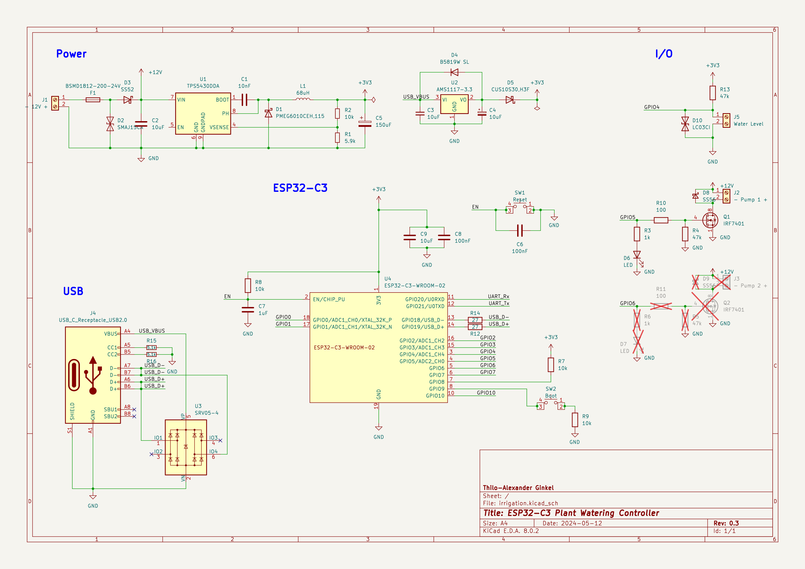

# ESP32-C3 Plant Watering Controller

A custom PCB for an ESP32-C3 based plant watering controller that features two channels to drive 12V water pumps and one input to check for low water level. If using esphome as [firmware](#firmware) it can be easily integrated into [Home Assistant](https://www.home-assistant.io/).


If you'd like to solder the PCB yourself, the smallest component to be soldered is 0603. The list of components and their placement is available as [interactive BOM](bom/ibom.html).

If you only need one channel (for a single pump), you can leave R5, R6, R11 D7, D9, Q2 and J3 unpopulated.

## Schematic



## External Parts

For a full-fledged plant watering solution you'll need some additional components/parts. Links go to AliExpress, but you can of course source the components from other sources if you prefer a different suppliers.

* [Submersible 12V water pump](https://aliexpress.com/item/1005005489175847.html)
* [Water level sensor](https://aliexpress.com/item/1005004306055007.html)
* [Water filter (8mm)](https://aliexpress.com/item/1005005032983727.html)
* [Sprinklers](https://aliexpress.com/item/1005004917374250.html)
* [8mm to 4mm connector](https://aliexpress.com/item/1005004875653640.html)
* 8mm hose
* 4mm hose
* Water reservoir, e.g., IKEA HÅLLBAR (35 l)

## Firmware

The firmware I am running on the controller is based on [esphome](https://esphome.io/). I am using the following snippet (for a single channel and a moisture sensor named `sensor.plant_herbs_balcony_soil_moisture`), which you'll probably want to customize to integrate with your Home Assistant instance and WiFi.

```
globals:
  - id: last_run
    type: time_t
    restore_value: yes
    initial_value: '0'

esphome:
  name: plant-watering
  name_add_mac_suffix: true
  friendly_name: ESP32-C3 Plant Watering Controller
  platformio_options:
    board_build.flash_mode: dio
    board_build.f_flash: 40000000L
    board_build.flash_size: 4MB
    # run with 80 MHz
    board_build.f_cpu: 80000000L

esp32:
  board: esp32-c3-devkitm-1
  framework:
    type: esp-idf
    sdkconfig_options:
      CONFIG_COMPILER_OPTIMIZATION_SIZE: y
  variant: esp32c3

mqtt:
  broker: [...]
  username: [...]
  password: [...]
  on_message:
    - topic: esphome/plant_watering/pump1
      payload: 'ON'
      then:
        - if:
            condition:
              binary_sensor.is_on: water_level
            then:
              - globals.set:
                  id: last_run
                  value: !lambda 'return id(homeassistant_time).now().timestamp;'
              - logger.log: "Turning irrigation 'pump1' on"
              - output.turn_on: pump1
              - logger.log: "Waiting 20s"
              - delay: 20s
              - logger.log: "Turning irrigation 'pump1' off"
              - output.turn_off: pump1
            else:
              - logger.log: "Water level is critical - refusing to turn on irrigation"

output:
  - platform: gpio
    pin:
      number: GPIO5
      mode:
        output: true
        pulldown: true
      drive_strength: 5mA
    id: pump1
  - platform: gpio
    pin:
      number: GPIO6
      mode:
        output: true
        pulldown: true
      drive_strength: 5mA
    id: pump2

binary_sensor:
  - platform: gpio
    pin:
      number: GPIO4
      mode:
        input: true
      inverted: false
    name: "Water Level"
    id: water_level
    filters:
      - delayed_on: 1s
      - delayed_off: 1s
    on_release:
      then:
        - logger.log: "Water level critical - turning off all pumps"
        - output.turn_off: pump1
        - output.turn_off: pump2

sensor:
  - platform: uptime
    name: "ESP32-C3 Plant Watering Controller Uptime"

  - platform: wifi_signal
    name: "ESP32-C3 Plant Watering Controller WiFi Signal"
    update_interval: 15s

  - platform: homeassistant
    name: "Soil humidity"
    entity_id: sensor.plant_herbs_balcony_soil_moisture
    id: plant_herbs_balcony_soil_moisture

text_sensor:
  - platform: template
    name: "ESP32-C3 Plant Watering Controller Last Run"
    icon: mdi:clock-start
    lambda: |-
      return ESPTime::from_epoch_local(id(last_run)).strftime("%Y-%m-%dT%H:%M:%S");
    update_interval: 60s

time:
  - platform: homeassistant
    id: homeassistant_time
    on_time:
      - cron: '00 /5 18-6 * * *'
        then:
        - if:
            condition:
              and:
                - binary_sensor.is_on: water_level
                - lambda: |-
                    return id(plant_herbs_balcony_soil_moisture).state < 55;
                - lambda: |-
                    return id(homeassistant_time).now().is_valid() && (id(homeassistant_time).now().timestamp - id(last_run) > 43200);
            then:
              - globals.set:
                  id: last_run
                  value: !lambda 'return id(homeassistant_time).now().timestamp;'
              - logger.log: "Turning irrigation 'pump1' on"
              - output.turn_on: pump1
              - logger.log: "Waiting 20s"
              - delay: 20s
              - logger.log: "Turning irrigation 'pump1' off"
              - output.turn_off: pump1
            else:
              - logger.log:
                  format: "Water level: %d, average soil moisture: %.1f - refusing to water plants"
                  args: ['id(water_level).state', 'id(weighted_soil_moisture).state']
```


## Integration

The PCB does not offer a built-in mechanism to measure soil humidity, but the [b-parasite](https://github.com/rbaron/b-parasite) open source project provides a suitable DIY capacitive soil moisture sensor that can easily be integrated using ZigBee / Home Assistant.

## License
The hardware and associated design files are released under the [Creative Commons CC BY-SA 4.0 license](https://creativecommons.org/licenses/by-sa/4.0/).
